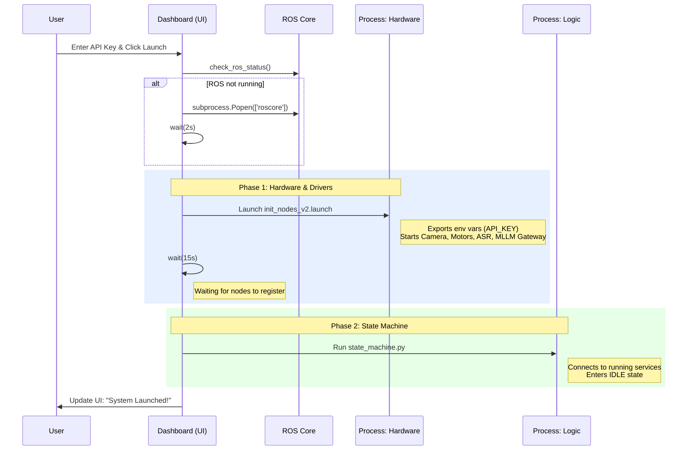
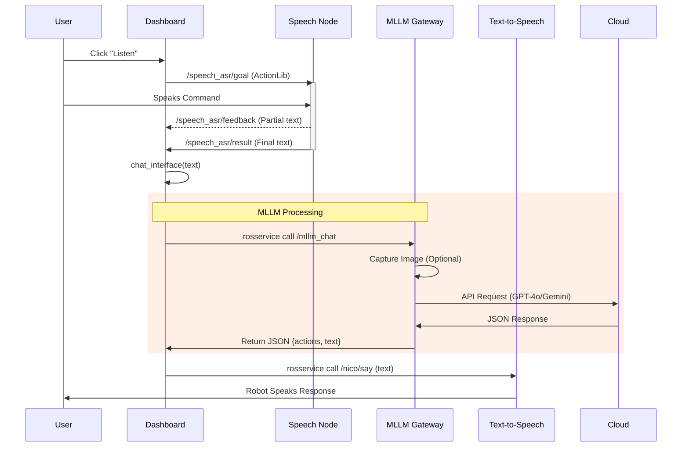

# ELMiRA v2.1 Upgrade Plan: Operations Center (Dashboard)

**Document Version:** 1.0  
**Date:** January 11, 2026  
**Status:** Implemented (Beta)  
**Project:** NICO Humanoid Robot - Usability Upgrade

---

## Table of Contents
1. [Executive Summary & Goals](#section-1-executive-summary--goals)
2. [Problem Analysis](#section-2-problem-analysis)
3. [Proposed Solution: ELMiRA Ops Center](#section-3-proposed-solution)
4. [Tech Stack](#section-4-tech-stack)
5. [Implementation Details](#section-5-implementation-details)
6. [User Manual](#section-6-user-manual)
7. [Future Roadmap](#section-7-future-roadmap)

---

# SECTION 1: Executive Summary & Goals

## 1.1 Executive Summary

While **ELMiRA v2** successfully introduced a unified Multimodal LLM gateway (3-5x performance boost), the **operational complexity** increased. Running the system requires managing multiple terminal windows, manually setting environment variables (API keys), and launching separate scripts for hardware nodes and state machines.

**ELMiRA v2.1** introduces the **ELMiRA Ops Center**: a unified, web-based dashboard that acts as a single control plane for the entire robot. It abstracts away the underlying ROS complexity, handles process lifecycle management, and provides a user-friendly interface for chat, voice interaction, and system monitoring.

## 1.2 Goals

*   **Zero-Terminal Operation:** Enable users to launch and control the robot without touching the command line (after initial script start).
*   **Unified Configuration:** Centralize API key management and calibration offsets.
*   **Process Management:** Prevent "zombie" processes by automatically handling startup/shutdown sequences.
*   **Visual Feedback:** Provide real-time logs and status indicators in a GUI.
*   **Enhanced Interaction:** Enable "Click-to-Speak" and chat history visualization.

---

# SECTION 2: Problem Analysis

## 2.1 Current Workflow (v2.0)

To run ELMiRA v2, a user must:

1.  **Terminal 1:** Run `roscore`.
2.  **Terminal 2:**
    *   `source activate.bash`
    *   `export OPENAI_API_KEY=...`
    *   `roslaunch elmira init_nodes_v2.launch ...`
3.  **Terminal 3:**
    *   `source activate.bash`
    *   `rosrun elmira state_machine.py`

**Pain Points:**
*   **Context Switching:** Users monitor 3 separate windows for logs.
*   **Env Var Fatigue:** Repeatedly exporting keys or editing `.bashrc`.
*   **Cleanup Issues:** Ctrl+C in one window doesn't always kill child processes, leading to port conflicts.
*   **No Feedback:** No visual indication of what the robot "heard" or "thought" without digging into logs.

---

# SECTION 3: Proposed Solution: ELMiRA Ops Center

We introduce a **Python-based Dashboard** (`dashboard.py`) that wraps the entire ROS lifecycle.

## 3.1 Architecture

```
┌───────────────────────────────────────────────────────────────┐
│                   ELMiRA DASHBOARD (v2.1)                     │
│                   (Gradio Web Server)                         │
├──────────────────────────────┬────────────────────────────────┤
│  UI LAYER                    │  backend LAYER                 │
│                              │                                │
│  [ Launch Button ] ──────────┼─▶ Orchestration Logic          │
│  [ Config Inputs ] ──────────┼─▶ Config Persistence (JSON)    │
│  [ Chat Window   ] ──────────┼─▶ ROS Topic Monitor            │
│  [ Logs Display  ] ◀─────────┼─▶ Log File Reader (Tail)       │
└──────────────────────────────┴────────────────────────────────┘
               │                               │
               ▼                               ▼
       ┌───────────────┐               ┌───────────────┐
       │ Subprocess 1  │               │ Subprocess 2  │
       │ (Init Nodes)  │               │(State Machine)│
       └───────────────┘               └───────────────┘

## 3.2 System Execution Flow

### 3.2.1 Startup Sequence

The Dashboard acts as the system orchestrator, ensuring services come online in the correct order to prevent race conditions.



### 3.2.2 Interaction Flow (Voice Command)

When the user clicks "Listen", the Dashboard facilitates a complete closed-loop interaction.



## 3.3 Key Features

1.  **One-Click Launch:** Automates the 3-terminal sequence.
2.  **Persistent Config:** Saves API keys and preferences to `~/.elmira_config.json`.
3.  **Live Log Streaming:** Pipes `roslaunch` and `rosrun` stdout/stderr to the web UI.
4.  **Integrated ASR/TTS:** "Listen" button triggers robot hearing; text responses are auto-spoken.
5.  **Calibration UI:** Sliders for X/Y/Z offsets to fine-tune grasping without code edits.

---

# SECTION 4: Tech Stack

| Component | Technology | Reasoning |
|-----------|------------|-----------|
| **Frontend/UI** | **Gradio** (Python) | Fast prototyping, native Python integration, built-in event loop. |
| **Process Mgmt** | `subprocess` + `psutil` | Robust handling of PID groups and signal propagation. |
| **Config** | JSON | Simple, human-readable persistence. |
| **ROS Interface** | `rospy` + `subprocess` | Hybrid approach: `rospy` for topics, `subprocess` for launching nodes. |

---

# SECTION 5: Implementation Details

## 5.1 File Structure

```
api/src/ELMiRA/scripts/
├── dashboard.py           🆕 (Main entry point)
├── v2/
│   └── (Existing v2 core files)
```

## 5.2 Dashboard Tabs

### Tab 1: 🛠️ Setup
*   **Install Requirements:** Buttons to run `pip install` commands for lazy setup.
*   **Environment Check:** Validates Python version and ROS installation.

### Tab 2: ⚙️ Mission Control
*   **Configuration:** Dropdowns for Provider (OpenAI/Google), Password field for API Keys.
*   **Calibration:** Sliders for physical offsets.
*   **Process Control:** "Launch ELMiRA" (Start) and "Stop System" (Kill) buttons.
*   **Status Indicators:** Red/Green status for ROS Core.

### Tab 3: 💬 Command Center
*   **Chat Interface:** Standard chatbot UI for text interactions.
*   **Voice Control:** "Listen" button triggers `ActionLib` goal for ASR.
*   **Feedback/Reasoning:** Displays the "Thought Chain" from the MLLM.

### Tab 4: 🖥️ Terminals
*   **Aggregated Logs:** Real-time tail of `launch_nodes.log` and `launch_sm.log`.

## 5.3 Process Orchestration Logic

The launch sequence is strictly ordered:
1.  Check for `roscore`.
2.  Write configuration vars.
3.  Launch `init_nodes_v2.launch` (Nodes) -> Detach process -> Capture PID.
4.  Wait 15s for hardware initialization.
5.  Launch `state_machine.py` (Logic) -> Detach process -> Capture PID.
6.  Start Log Monitor threads.

---

# SECTION 6: User Manual

## 6.1 Installation

```bash
cd ~/catkin_ws/src/NICO-software/api
pip install gradio psutil
```

## 6.2 Running the Dashboard

```bash
python3 src/ELMiRA/scripts/dashboard.py
```
Open **http://0.0.0.0:7860** in your browser.

## 6.3 First Time Setup
1.  Go to **Mission Control**.
2.  Select **Provider** (e.g., OpenAI).
3.  Enter **API Key**.
4.  Click **Launch ELMiRA**.
5.  Wait for "System Launched!" message.
6.  Switch to **Command Center** to talk to the robot.

---

# SECTION 7: Status & Roadmap

## 7.1 Current Status (v2.1 Beta)
*   ✅ **Core UI:** Implemented and functional.
*   ✅ **Launch Logic:** Working for standard v2 stack.
*   ✅ **Chat:** Connected to `/mllm_chat` service.
*   ✅ **Logs:** Basic polling implemented.

## 7.2 Known Limitations
*   Log streaming has a slight delay (polling based).
*   Killing processes sometimes leaves `roscore` running (by design, to avoid disrupting other tools).

## 7.3 Future Roadmap (v2.2)
*   **Camera Feed:** Embed live MJPEG stream from the robot's eyes directly into the dashboard.
*   **Visual Debug:** Draw bounding boxes on the camera feed in real-time.
*   **Plan Editing:** Allow users to approve/edit the MLLM's plan before execution.

